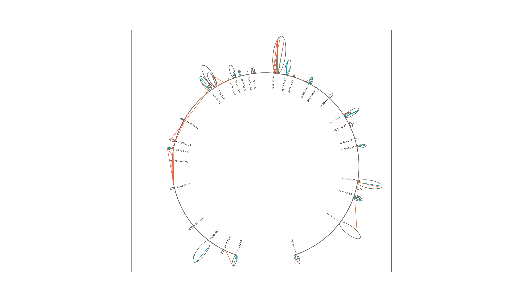

.. chiron documentation master file, created by
   sphinx-quickstart on Fri Feb 19 09:43:38 2016.
   You can adapt this file completely to your liking, but it should at least
   contain the root `toctree` directive.
    

Welcome to Chiron's documentation
==================================

In the current release, Chiron has two modules, *Topology* and *Diagrams*, 
avaiable in Chiron namespace. There are also several general purpose functions
for visualizing Chromatin Conformation Capture Data, particularly, rainbow diagrams
and loop diagrams along arc. 

Example loop diagram: 

.. toctree::
   :maxdepth: 5

Topology: 
----------------------------------

.. automodule:: chiron.topology
    :members:
    
Diagrams:
----------------------------------

.. automodule:: chiron.diagrams
    :members:

    
Indices and tables
==================

* :ref:`genindex`
* :ref:`modindex`
* :ref:`search`

